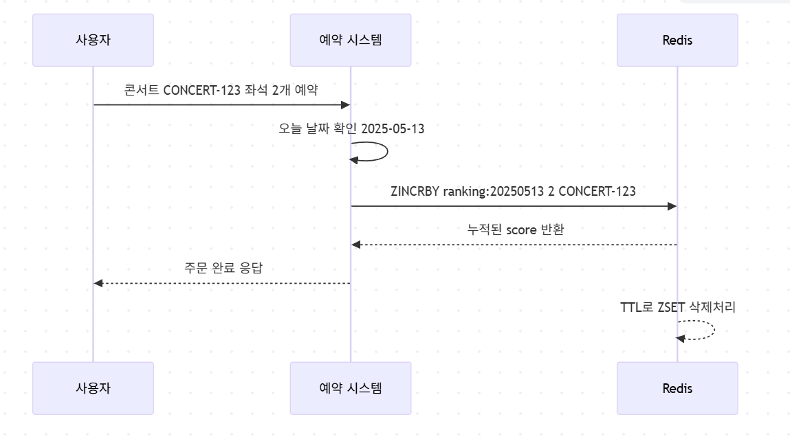

# hh-reservation-concert-project


<details>
  <summary>1. 요구사항 분석</summary>
<h2>요구사항 정리</h2>
<hr>

- 콘서트 예약 서비스` 구현해 봅니다.
- 대기열 시스템을 구축하고, 예약 서비스는 작업가능한 유저만 수행할 수 있도록 해야합니다.
- 사용자는 좌석예약 시에 미리 충전한 잔액을 이용합니다.**
- 좌석 예약 요청시에, 결제가 이루어지지 않더라도 일정 시간동안 다른 유저가 해당 좌석에 접근할 수 없도록 합니다.

## Requirements

- 아래 5가지 API 를 구현합니다.
    - 유저 토큰 발급 API
    - 예약 가능 날짜 / 좌석 API
    - 좌석 예약 요청 API
    - 잔액 충전 / 조회 API
    - 결제 API
- 각 기능 및 제약사항에 대해 단위 테스트를 반드시 하나 이상 작성하도록 합니다.
- 다수의 인스턴스로 어플리케이션이 동작하더라도 기능에 문제가 없도록 작성하도록 합니다.
- 동시성 이슈를 고려하여 구현합니다.
- 대기열 개념을 고려해 구현합니다.

## API Specs

1️⃣ **`주요` 유저 대기열 토큰 기능**

- 서비스를 이용할 토큰을 발급받는 API를 작성합니다.
- 토큰은 유저의 UUID 와 해당 유저의 대기열을 관리할 수 있는 정보 ( 대기 순서 or 잔여 시간 등 ) 를 포함합니다.
- 이후 모든 API 는 위 토큰을 이용해 대기열 검증을 통과해야 이용 가능합니다.

> 기본적으로 폴링으로 본인의 대기열을 확인한다고 가정하며, 다른 방안 또한 고려해보고 구현해 볼 수 있습니다.
*** 대기열 토큰 발급 API
* 대기번호 조회 API**
>

**2️⃣ `기본` 예약 가능 날짜 / 좌석 API**

- 예약가능한 날짜와 해당 날짜의 좌석을 조회하는 API 를 각각 작성합니다.
- 예약 가능한 날짜 목록을 조회할 수 있습니다.
- 날짜 정보를 입력받아 예약가능한 좌석정보를 조회할 수 있습니다.

> 좌석 정보는 1 ~ 50 까지의 좌석번호로 관리됩니다.
>

3️⃣ **`주요` 좌석 예약 요청 API**

- 날짜와 좌석 정보를 입력받아 좌석을 예약 처리하는 API 를 작성합니다.
- 좌석 예약과 동시에 해당 좌석은 그 유저에게 약 **5분**간 임시 배정됩니다. ( 시간은 정책에 따라 자율적으로 정의합니다. )
- 만약 배정 시간 내에 결제가 완료되지 않는다면 좌석에 대한 임시 배정은 해제되어야 한다.
- 누군가에게 점유된 동안에는 해당 좌석은 다른 사용자가 예약할 수 없어야 한다.

4️⃣ **`기본`**  **잔액 충전 / 조회 API**

- 결제에 사용될 금액을 API 를 통해 충전하는 API 를 작성합니다.
- 사용자 식별자 및 충전할 금액을 받아 잔액을 충전합니다.
- 사용자 식별자를 통해 해당 사용자의 잔액을 조회합니다.

5️⃣ **`주요` 결제 API**

- 결제 처리하고 결제 내역을 생성하는 API 를 작성합니다.
- 결제가 완료되면 해당 좌석의 소유권을 유저에게 배정하고 대기열 토큰을 만료시킵니다.

<aside>
💡 **KEY POINT**

</aside>

- 유저간 대기열을 요청 순서대로 정확하게 제공할 방법을 고민해 봅니다.
- 동시에 여러 사용자가 예약 요청을 했을 때, 좌석이 중복으로 배정 가능하지 않도록 합니다.
</details>

<details>
  <summary>2. 유저스토리</summary>
<h2>유저스토리</h2>
<hr>
  

### 주요 유즈 케이스 시나리오

#### 1. 대기열 진입
  - 고객이 조회 및 예약을 위해 대기열에 진입합니다.
  - 진입 가능해질때까지, 현재 대기열 순번을 표기합니다.
#### 2. 콘서트 예약가능한 날짜 조회/ 임시 예약
  - 발급된 토큰으로 조회 및 좌석 예약을 진행합니다.
  - 콘서트 좌석은 임시 예약되어 5분간 예약 불가 됩니다.
#### 3. 좌석 결제/포인트 결제
  - 임시 예약 성공시에 결제를 진행합니다.
  - 결제 성공 시, 좌석 예약을 확정합니다.
  


</details>

<details>
  <summary>3. 플로우 차트</summary>
<h2> 콘서트 예약가능한 날짜 조회/ 임시 예약 플로우 차트</h2>
<hr>
  

<h2> 좌석 결제/포인트 결제 플로우 차트 </h2>
<hr>
  
</details>

<details>
  <summary>4. 도메인 설계(클래스 다이어그램)</summary>
</details>

<details>
  <summary>5. ERD 설계</summary>
<h2> 결제, 예약, 고객, 좌석, 콘서트, 대기열, 토큰에 대한 스키마 설계 </h2>
<hr>
  
</details>

<details>
  <summary>6. 대기열 시퀀스 다이어그램, 상태 다이어그램</summary>
<h2> 대기열 시퀀스 다이어그램 </h2>
<hr>
  
<h2> 대기열 상태 다이어그램 </h2>
<hr>
  

</details>

<details>
  <summary>7. 조회/예약 시퀀스, 상태 다이어그램</summary>
<h2> 조회 시퀀스 다이어그램 </h2>
<hr>
  
<h2> 조회 상태 다이어그램 </h2>
<hr>
  
<h2> 조회 시퀀스 다이어그램 </h2>
<hr>
  
<h2> 조회 상태 다이어그램 </h2>
<hr>
  


</details>

<details>
  <summary>8. 충전/결제 시퀀스, 상태 다이어그램</summary>
<h2> 충전/결제 시퀀스 다이어그램 </h2>
<hr>
  
<h2> 충전/결제 상태 다이어그램 </h2>
<hr>
  

</details>

<details>
  <summary>9. API SPECS</summary>
    <h2> 대기열 API</h2>
    <hr>
    
  
  <h2> 예약 접근 가능 API</h2>
    <hr>
      

  <h2> 예약 조회 API</h2>
    <hr>
      

  <h2> 마일스톤</h2>
    <hr>
      

  <h2> 마일스톤</h2>
    <hr>
      

  <h2> 마일스톤</h2>
    <hr>
      

  <h2> 마일스톤</h2>
    <hr>
      

  <h2> 마일스톤</h2>
    <hr>
      

</details>

<details>
  <summary>10. Milestones</summary>
  <h2> 마일스톤</h2>
  <hr>
  
</details>


<details>
  <summary>11. WIL</summary>

## 1주차 WIL
### 과제 목표
- mocking 과 stubbing 을 통한 unit 테스트 작성법 숙지
- 통합 테스트 작성과 동시성 테스트 작성

#### 1) 실습 내용:
1. 포인트 결제/충전/사용에 대한 API 를 구현하고 단위테스트를 작성했다.
2. 단일 서버에서 일어날 수 있는 동시성 이슈에 대한 이슈를 해결했다.

#### 2) 학습 내용:
1. 테스트 피라미드란 무엇인가?
   - 유닛테스트, 통합테스트, E2E 테스트
2. 의존성을 제거하기 위한 방법은 무엇이 있을까?
   - mocking
   - fake
3. 동시성 테스트에 대한 정책 짜기
   - 입금, 출금이 동시에?
   - 입급이 동시에 2번?
   - 출금이 동시에 2번?
4. 테스트의 도구는 무엇이 있을까?
   - 러너, 어썰션, 모킹, 테스트 훅
5. 좋은 테스트의 기준은 무엇일까?
  - 실패하기 쉬운 테스트
6. 테스트 더블은 무엇일까?
  - mock, stub, fake, spy
7. mutex vs semaphore
   - MUTEX 는 여러 프로세스를 실행하는 환경에서 자원에 대한 접근 제한을 의미한다. ACQUIRE(락 획득), RELEASE(락 해제) 행위를 합니다.
   - SEMAPHORE 은 임계구역에 접근할 수 있는 프로세스 수를 정해두고 WAIT을 실행하다가, SIGNAL로 진입합니다.
#### 3) 회고:
1. 지식을 습득할 때, 왜?라는 질문들을 많이 던지고 범주를 나눠서 정리하면, '일을 잘하기 쉬워지구나'를 멘토님을 보고 느꼈다. 
2. 단일 서버내 멀티스레드의 자원 경합에 대한 이슈를 세가지 시나리오로 해결해봤다. 또, 쓰레드를 병렬로 열어서 테스트하는 법을 이해할 수 있었다.
   - synchronized
   - CAS (atomic), ReentrantLock
   - ConcurrentLinkedQueue, 동시성 자료구조
3. 마지막으로, 내가 뭘 모르는지 정의하고, 문제에 대해 공유하는 방법을 이해할 수 있었다.


## 2주차 WIL

### Swagger 구현 및 도메인 설계 및 설계 세부사항 정리
#### 1) 실습 내용:
1. 유저스토리들을 생성으로 요구사항을 명확히 분석하기 (애매모호한것을 뾰족하게한다.)
   - 유저스토리 
   - 플로우 차트로 유즈 케이스 분석
2. OpenAPI 명세로 협업
3. 도메인 모델링
   - 상태 다이어그램
   - 도메인 간 메시지 식별
   - 행위에 대한 시퀀스 다이어그램
4. ERD 설계

#### 2) 학습 내용:
1. 시퀀스 다이어그램을 언제 사용할지
2. 플로우 차트를 통해 유즈케이스 분석하기
3. 도메인 모델링
   - 도메인 간 메시지 식별
   - 도메인의 상태 다이어그램
3. AGGREGATE ROOT 식별 및 패키지 분리


#### 3) 회고:
1. 추상적인 아이디어를 뾰족하게 표현하는 법
2. Mock API 전달해서, 빠른 커뮤니케이션 진행
3. 어떤 아이디어는 어떤 툴로 표현해야 좋은지 고민할 수 있었음

## 3주차 WIL
### 애플리케이션 아키텍처 구조
#### 1) 실습 내용:
1. DIP를 통해 의존성 방향을 도메인을 향해 설정
2. 유저 시나리오들에 대한 비즈니스 로직 개발 및 단위 테스트 작성

#### 2) 학습 내용:
1. 클린아키텍처가 중요한 이유?
   - 변경의 범위를 최소한으로 만들기 위해
   - DIP, OCP 를 지키기 위해
2. 멘토님의 성과를 공유 받으면서 내가 어떤 부분들을 측정하고, 해결하고 공유하는 법을 선택할지 생각해볼 수 있었다.
   - 해결 방법을 왜하는지?
   - 목표 수치는 무엇인지?
   - 해결하는 방법은 무엇이 있는지?
   - 이해를 높이는 도표는 무엇이 있는지?
3. 외부 연동시 팁들
   - Connection Pool 이 보통 thread 당으로 물려 이슈 생김
   - 비동기로 해결하게 되면, 결제 처리는 정책으로 풀어낸다. 
   - 정책에 따라, 예약과 결제를 하나로 묶는 경우도 있다.
   - 장애시
     - 외부 서비스 에러시, 써킷 건다.
     - REDIS로 대기열 운영하다가 장애지점은 메모리 적재량 초과

#### 3) 회고:
1. DIP를 적용해서, 비즈니스 로직을 구현했다.
   - Interceptor로 token 발급 받은 고객만 예약할 수 있도록 처리
   - Scheduler로 대기열 입장 처리
     - 대기열 입장 처리에 대한 정책 고민 
       - 시간당 n명의 인원 입장
       - 입장 인원들의 상태 처리이후 n명의 인원 입장


## 4주차 WIL

### 통합테스트 작성 및 인덱스를 통한 쿼리 최적화 
#### 1) 실습 내용:

#### 2) 학습 내용:
- Lost Update, Dirty Read, Phantom Read
- DeadLock을 발생시키는 시나리오
  - 데드락 회피전략 구성
- 트랜잭션 충돌에 대한 정책 수립
  - retry
  - timeout
- 낙관적 락과 비관적 락 사용

#### 3) 회고:


## 5주차 WIL

### 통합테스트 작성 및 동시성 테스트 작성
#### 1) 실습 내용:

#### 2) 학습 내용:

#### 3) 회고:


</details>


<details>
  <summary>12. 동시성 개선안</summary>

# 1. 단일 서버내 동시성 이슈

## 1. 기술적인 문제 정의
 - 단일 서버내에서 멀티 스레드내 공유 자원에 대한 동시성 이슈 해결

## 2. 개선 정의
  - 공유 자원에 멀티스레드가 접근을 제어하여 데이터의 일관성을 보장(1)하고 데드락을 방지(2)하며 성능을 유지(3)합니다.
  - 단일 서버에 대한 동시성 이해를 실무에서 사용하는 경우는 아래와 같습니다.
    - 로컬 데이터인 경우(ThreadLocal, Local Cache, Hibernate Event Queue)
    - 로컬 파일 및 로그 파일의 경우
    - 로컬에서 유지되는 스티키 세션의 경우
   
### A. 해결책: atomic class (락프리)
    - Compare And Swapped 메커니즘으로 데드락 문제 없고 높은 성능 유지 가능
### B. 해결책: 동시성 데이터 구조
    - thread safe 한 ConcurrentHashMap 
        - 특정 버킷에만 락을 걸고 put
        - get은 락이 존재하지 않음
        - cas와 synchronized를 사용하여 최적화 됨
    - thread safe 한 LinkedQueue로 queue를 통한 작업 제어
```java  
private final ConcurrentLinkedQueue<UserTransaction> requestQueue = new ConcurrentLinkedQueue<>();

public void addQueue(Long userId, Long amount) {
  // 요청을 큐에 추가
  requestQueue.offer(new UserTransaction(userId, amount));

  // 큐에서 요청을 비동기적으로 처리
  executorService.submit(() -> processQueue());
}
```

### C. 해결책: LOCK
    - ReentrantLock을 사용하여, 임계영역에서 제어를 할 수있는 설정 가능
```java  
private final ConcurrentHashMap<Long, Lock> userLocks = new ConcurrentHashMap<>();
private Lock getUserLock(Long userId) {
  return userLocks.computeIfAbsent(userId, id -> new ReentrantLock());
}
// 락을 통해 유저에 대한 동시성 제어
if (userLock.tryLock()) {
try {
  // 비즈니스 로직
} finally {
userLock.unlock();
}

```
## 4. 장점, 단점
### V1 Synchronized 활용

- 성능
    - 성능 하
- 장점
    - 간단함
- 단점
    - synchronized 를 동기화된 메서드 `synchronized void charge()` 와 같은 방식으로 사용하게 되면, 메서드 단위로 여러 스레드가 접근할 수 없음

### V2 ReentrantLock 활용
- 성능
    - 성능 중
- 장점
    - 공정성 설정 가능 (락 획득 시간 지정)
    - 사용하기 편리하다.
- 단점
    - 데드락을 관리하기 어려움
    - 동시성 관리에 있어서, 모든 동시 요청을 처리하고 싶을 때, lock의 제한으로 처리할 수 없음

### V3 ConcurrentLinkedQueue 활용
- 성능
  ? (시간 측정 테스트 못함)
- 장점
    - 모든 요청에 대해서 lock에 대한 관리 없이 처리할 수 있다.
- 단점
    - 너무 많은 요청이 쌓일 경우, OOM 의 위험이 있다.


# 2. DB 접근의 동시성 이슈

## 1. 기술적인 문제 정의
    - 멀티 스레드내 DB 공유 자원에 대한 동시성 이슈 해결
## 2. 개선 정의
  - 공유 자원에 멀티스레드가 접근을 제어하여 데이터의 일관성을 보장(1)하고 데드락을 방지(2)하며 성능을 유지(3)합니다.
  - DB 동시성 이해를 실무에서 사용하는 경우는 아래와 같습니다.
      - 잦은 업데이트가 필요한 DB 레코드를 동시에 접근할 때 일관성을 보장합니다.
      - 잦은 업데이트가 필요한 DB 레코드에 대한 데드락 이슈

### A. 해결책: 낙관적 락
    - 애플리케이션에서 row에 version 값을 생성하여, update를 반영합니다. 실패시에, retry 혹은 반영되지않게 합니다.
    - retry 요청을 처리하지 않고 실패시키는 정책을 적용할 때, 성능적으로 비용이 적습니다.
    - 충돌이 많이 발생하고 retry를 많이 적용해야된다면, 다른 방법으로 개선하는것이 좋습니다. (많은 요청에 의해 DB Connection 및 스레드 점유됨)


#### AS-IS

##### A. 대상 유저 시나리오: 예약 시나리오
- 공유 자원: 좌석
- 설명: 여러 고객들이 한개의 좌석에 대해 예약하려고 할때, 한 고객이 트랜잭션이 완료되기 전에 다른 고객이 예약을 요청할 수 있다.


#### TO-BE
##### A. 대상 유저 시나리오: 예약 시나리오
- 정합성 검증 대상 (콘서트 예약 시나리오: 하나의 요청만 성공시키면 되는 경우)
    - 10 개의 쓰레드를 병렬로 열어서 테스트하여 콘서트 예약이 하나가 성공하는 것을 테스트합니다.
    - 1개 이상의 성공 하지 않는지 검증합니다.
      - 동시 요청에 대해서 1회만 반영해도되는 경우 낙관적락을 사용하고 나머지 요청을 실패 시킬수있다.
      - 하지만, 낙관적 락으로 동시에 여러번 상태가 변경되어야 하는 경우에는 적절하지 않을 수 있다.
        - 예시) 포인트 충전 1000 (성공), 포인트 사용 1000 (실패), 포인트 충전 1000(성공) -> 순서에 민감한 포인트 시나리오의 경우, 정합성을 유지하기 힘들어진다.
```java  

// 좌석에 대한 Version 필드 생성
@Entity
@Table(name = "seats")
public class Seat {

  @Column(name = "id", columnDefinition = "binary(16)")
  @Id
  private UUID id;
  @Column(name = "concert_id", nullable = false)
  private UUID concertId;
  @Column(name = "status", nullable = false, columnDefinition = "varchar(255)")
  @Enumerated(EnumType.STRING)
  private SeatStatus seatStatus;
  @Column(name = "created_at", nullable = false)
  private LocalDateTime createdAt;

  @Version
  private Long version;
```

```java  
@Test
@DisplayName("동일 유저가 동시 예약 요청 시 하나만 성공해야 함")
void concurrencyReserveTest() throws InterruptedException {
  // Given
  int numberOfThreads = 10;
  ExecutorService executorService = Executors.newFixedThreadPool(numberOfThreads);
  CountDownLatch latch = new CountDownLatch(numberOfThreads);

  // When

  for (int i = 0; i < numberOfThreads; i++) {
    executorService.submit(() -> {
      try {
        defaultReservationService.bookTemporarySeat(new TemporaryReservationRequest(userId, seat));
        results.add(true);
      } catch (Exception e){
        results.add(false);
      } finally {
        latch.countDown();
      }
    });
  }

  latch.await();
  executorService.shutdown();
  // When 한개만 통과하는 것이 성공
  long successCount = results.stream().filter(result -> result).count();
  assertThat(successCount).isEqualTo(1);

}
```

### B. 해결책: 비관적 락
    - 'SELECT ... FOR UPDATE' 를 사용하면, X-Lock을 사용하게되고, 다른 트랜잭션은 접근할 수 없습니다.
    - 즉각적 정합성이 필요한 경우 사용하게되고, 경합이 많은 경우 사용하면 좋지 않습니다. (Lock에 따른, 성능 저하 및 의도치 않은 데드락)


#### AS-IS
##### A. 대상 유저 시나리오: 잔액 충전, 사용, 결제 시나리오
- 공유 자원: 포인트 잔고
- 설명: 
  - 아래와 문제가 생길 수 있음, 
      - (1) Lost Update(즉, 최종적 하나의 업데이트만 반영되는 이슈가 생김)
        - 입금, 출금이 동시에?
      - (2) 중복 이벤트 처리가 되지 않음
        - 입급이 동시에 2번?
        - 출금이 동시에 2번?
```java  

@Transactional
public ChargeResponse chargePoint(ChargeRequest chargeRequest, UUID paymentId)

@Transactional
public GetBalanceResponse getUserPoint(GetBalanceRequest request) 

@Transactional
public UseResponse useUserPoint(UseRequest request)

// 포인트를 조회하는 시점에 x-lock을 겁니다. 
public interface PointRepository {
  @Lock(LockModeType.PESSIMISTIC_WRITE)
  Optional<Point> findByUserId(UUID uuid);
  
```
#### TO-BE
##### A. 대상 유저 시나리오: 잔액 충전, 사용, 결제 시나리오
- 비관적 락을 사용해, 각각의 요청들을 하나씩 처리하게 진행합니다.
- 정합성 검증 절차 (포인트 충전 및 결제 시나리오: 모든 요청을 성공시키야 되는 경우)
    - 10 개의 쓰레드를 병렬로 열어서 테스트하여 결제 요청이 모두 성공하는 것을 테스트합니다.
    - 누락없이 모든 요청이 수행되는지 검증합니다.
```java  
  @Test
  @DisplayName("동일 유저가 동시 예약 요청 시 하나만 성공해야 함")
  void concurrencyReserveTest() throws InterruptedException {
  // Given
  int numberOfThreads = 10;
  ExecutorService executorService = Executors.newFixedThreadPool(numberOfThreads);
  CountDownLatch latch = new CountDownLatch(numberOfThreads);

  // When
  for (int i = 0; i < numberOfThreads; i++) {
    executorService.submit(() -> {
      try {
        defaultReservationService.bookTemporarySeat(new TemporaryReservationRequest(userId, seat));
        results.add(true);
      } catch (Exception e) {
        results.add(false);
      } finally {
        latch.countDown();
      }
    });
  }

  latch.await();
  executorService.shutdown();
  // When 한개만 통과하는 것이 성공
  long successCount = results.stream().filter(result -> result).count();
  assertThat(successCount).isEqualTo(1);

}
```


### C. 참고 자료: MySQL에서 다른 락들은 무엇이 있을까? 또한, 동시성제어는 어떻게 하고 있을까? 
- S-Lock (공유락)
  - 설정된 트랜잭션은 읽기 작업만 수행 가능하다.
  - 다른 트랜잭션은 읽기 가능하다.
- X-Lock (배타락)
  - 설정된 트랜잭션은 읽기, 쓰기 모두 수행가능하다.
  - 다른 트랜잭션은 대기해야한다.
- 레코드락
  - 스토리지 엔진 수준에서 테이블 레코드 자체를 잠그게 된다.
  - MySQL 에서는 인덱스 를 기준으로 락을 걸게 되는데 인덱스를 통해 검색되는 모든 레코드를 잠금하게된다.
  - 인덱스 부재시 풀스캔으로 모든 레코드 락을 걸게 된다.
- 갭락
  - 레코드와 레코드 사이의 간격을 락을 건다.
  - Phantom Read 를 방지하기위해, 범위에 해당하는 테이블 공간에 대해서 락을 건다.
  - Repeatable Read isolation level에서 undo 로그에서 tracsactionId를 기반으로 조회해서 PhantomRead가 안일어나게 방지하게된다.

## 3. as-is, to-be 데이터 증거 측정


## 4. 대안
### A. 한계점: 비관적 락, 낙관적 락을 사용할때, 요구치의 성능을 맞추기 힘듬
- 예를 들어, '좋아요' 와 같은 변경이 자주되는 데이터를 낙관적 락으로 구현시에, 정합성 이슈가 생긴다.
- 비관적 락으로 구현시에도 트래픽이 몰릴 시에 Timeout 으로 요청에 실패할 수 있습니다.

- Write 와 Read가 헤비한 데이터에 경우 다른 처리 방법이 필요합니다.
- MQ나 Redis를 활용한 요청 처리로 트래픽이 폭주할때, 버퍼를 확보하여 순서대로 정책에 맞춰 처리할 수 있습니다.

# 3. 다중 서버의 동시성 이슈

## 1. 기술적인 문제 정의
    - 다중 서버내 DB 공유 자원에 대한 동시성 이슈 해결

## 2. 개선 정의
- 다중 서버가 분산락을 통해 DB에 동시성 문제가 생기는 요청을 제한합니다.
  - 분산락을 도입하면서 생기는 이슈들에 대한 처리도 진행합니다.
    - Redis가 실패 했을 경우를 대비한 처리 (HA 구성 혹은 애플리케이션 로직 구성)
    - 데드락 예방을 위한, Lock Ordering 처리
    - 락 임계 시간 제한(lease time) 및, 락에 대한 범위 줄이기

## 3. as-is, to-be 데이터 증거 측정

### AS-IS
#### A. 예약 시나리오

```java  
    @Transactional
    public TemporaryReservationResponse bookTemporarySeat(
      TemporaryReservationRequest request
    ) {
    
    }

    @Transactional
    public ReservationResponse bookSeat(
      ReservationRequest request  
    ) {
    
    }
```
- 성능 측정 필요

#### B. 잔액 충전, 사용, 결제 시나리오
```java  

@Transactional
public TemporaryReservationResponse bookTemporarySeat(
    TemporaryReservationRequest request
) {

}
@Transactional
public ReservationResponse bookSeat(
    ReservationRequest request) {

}
```
- 성능 측정 필요


### TO-BE 
#### A. 예약 시나리오 
- 정합성 검증 대상 (콘서트 예약 시나리오: 하나의 요청만 성공시키면 되는 경우)
    - 10 개의 쓰레드를 병렬로 열어서 테스트하여 콘서트 예약이 하나가 성공하는 것을 테스트합니다.
    - 1개 이상의 성공 하지 않는지 검증합니다.
- 성능 측정 필요

```java  
@SimpleLock(lockKeys=[1,2,3])
@Transactional
public TemporaryReservationResponse bookTemporarySeat(
    TemporaryReservationRequest request
) {

}
@SimpleLock(lockKeys=[1,2,3])
@Transactional
public ReservationResponse bookSeat(
    ReservationRequest request) {

}

```
- simple lock 으로 해결 가능한지?
  - simple lock으로 구현 가능하다. 
    - 위에서도 낙관적 락을 이용한 best effort 전략으로 첫 요청 제외하고 다 실패 시키면서, 경쟁하는 자원(콘서트 좌석)에 대해 대기하는 스레드를 없애려고했다.
    - 이 경우에도 simple lock으로 가볍게 처리하는 편이 좋아 보인다.
- spin lock 으로 해결 가능한지?
  - spin lock으로 해결 할 수 없다.
    - 오래 걸리지 않는 자원이라면, 문제가 없지만, 임시 예약이 5분이상 이라고 한다면 그동안 spin lock이 소모하는 자원이 지나치게 클것으로 보인다.
- pub/sub lock 으로 해결 가능한지?
  - pub/sub 을 통해도 처리할 수 있다.
    - 하지만, pub,sub 도 소모되는 자원이라서 최적이 아니다. 

#### B. 잔액 충전, 사용, 결제 시나리오

- 정합성 검증 절차 (포인트 충전 및 결제 시나리오: 모든 요청을 성공시키야 되는 경우)
    - 10 개의 쓰레드를 병렬로 열어서 테스트하여 결제 요청이 모두 성공하는 것을 테스트합니다.
    - 누락없이 모든 요청이 수행되는지 검증합니다.
- 성능 측정 필요

```java  
@DistributeLock(lockKeys=[1,2,3])
@Transactional
public ChargeResponse chargePoint(ChargeRequest chargeRequest, UUID paymentId)
@DistributeLock(lockKeys=[1,2,3])
@Transactional
public GetBalanceResponse getUserPoint(GetBalanceRequest request)
@DistributeLock(lockKeys=[1,2,3])
@Transactional
public UseResponse useUserPoint(UseRequest request)

```

- simple lock 으로 해결 가능한지?
    - simple lock으로 해결 할 수 없다.
      - 충전이나, 포인트 사용 및 결제는 빠른 실패를 통해서, 즉각적인 일관성을 구현할 수 없다.
- spin lock 으로 해결 가능한지?
    - spin lock으로 해결 가능하다.
      - 동일 요청이 많이 들어온다면, 서버 부하가 심해져 최적은 아니다. 
      - 결제 요청은 오래 걸릴 수도 있어, 짧은 시간 동안 점유 해야하는 '임계 지점'이 길어 질 수 있따. 
- pub/sub lock 으로 해결 가능한지?
  - pub/sub lock은 해결 가능하다.
    - pub/sub 에 대한 갯수에 대해서 실험하고 최대 허용치를 검증하고 사용한다면, 최적의 사용이라고 생각한다.
    - 다만, pub/sub의 갯수가 지나치게 늘어날때를 대비한 처리도 필요해 보인다.


## 4. 각 락들에 대한 장점, 단점

| 구분 | Simple Lock | Spin Lock              | Pub/Sub Lock                    |
| --- | --- |------------------------|---------------------------------|
| 주요 명령어 | SET NX EX + DEL | SET NX EX + DEL (반복)   | SET NX EX + PUBLISH + SUBSCRIBE |
| 대기 방식 | 대기 없음 (즉시 실패) | 폴링(Polling) 방식         | 이벤트 기반 대기                       |
| 구현 복잡도 | 낮음 | 중간                     | 높음                              |
| 서버 부하 | 매우 낮음 | 높음 (반복 요청)   | 중간 + 비교적 메모리 사용량 높음             |
| 락 획득 확률 | 낮음 (한 번만 시도) | 높음 (반복 시도)             | 중간~높음                           |
| 데드락 위험 | EX 만료 기반 해결 | EX + 최대 재시도            | EX + 메시지 누락 주의                  |
| 적합한 환경 | 경쟁이 적은 환경, 짧은 작업 | 락 획득이 중요한 환경, 짧은 대기 시간 | 긴 대기 가능성, 서버 부하 감소 필요           |


## 5. 참고 자료: Global Lock의 종류
- Spin Lock
  - 락을 획득 할때까지, 반복적인 락 획득 시도 
  - 긴 대기가 예상 될때, 부하 심함
  - 로직이 짧을 때 사용 
- Simple Lock
  - 기본적인 락 획득 시도하고 실패시, 실패 처리
  - 로직이 짧을 때 사용
  - 재시도 없이 best effort 전략 (낙관락과 비슷)
- 분산 락
  - redis 메시징을 통해 채널 구독하여 락에 대기처리
  - 긴 대기 일때, 부하에 대한 처리 필요
- Red Lock
- Redis 는 어떻게 동시성을 보장하는 걸까?
- Redis에서 중요한 설정들 

# 4. 동시성 이슈를 피해가는 메시지 큐 도입

## 1. 기술적인 문제 정의

## 2. 개선 정의

# 5. 동시성 이슈를 피해가지 못하는 즉각적 일관성이 필요한 경우

</details>
<details>
  <summary>13. 캐시로 DB 보호하고 성능 개선하기</summary>

# 1. REDIS 활용한 조회 성능 개선

## A. 기술적인 문제 정의 (조회 성능 개선)

## B. 개선 정의 

## C. as-is, to-be 데이터 증거 측정


## D. 참고 자료: 캐싱 전략 && 로컬 캐시와 캐시
- 레이어드 캐싱 전략

- 데이터 불일치 문제

- redis 가용성에 대한 처리 

- 만료 정책

- 캐시 전략

</details>

<details>
  <summary>14. 빠른 일간 인기도랭킹을 Redis 기반으로 구현</summary>

# 1. redis ZSET을 활용한 일간 인기도 랭킹 

## A. 기술적인 문제 정의 
- 일간 콘서트 예약 랭킹을 redis의 zset으로 구현합니다.

## B. 개선 정의
- 일간 랭킹을 위한 redis key: "ranking:yyyyMMdd"에 "concertId"를 대상으로 예약 숫자를 증가 시킵니다.
- TTL을 통해 일주일이 지난 key값들은 삭제합니다.



- 매진시에 추가 점수를 부여합니다. 
  - 특정 날짜의 콘서트가 매진 될 시에 100000 을 부여합니다.
  - 중복으로 추가 점수 부여를 방지하기 위해 bucket을 체크합니다.


## C. as-is, to-be 데이터 증거 측정


### AS-IS

- 문제점
  - 주문량 기반 콘서트 랭킹은 DB에서 하루 1회 배치로 계산되어야함 -> 주문의 수가 많다면 DB에 부하 심함
  - 실시간 랭킹을 제공하지 못함
  - 랭킹 조회 시 복잡한 SQL Join과 집계 쿼리로 인해 성능 저하


### TO-BE

- 해결
  - DB 부하 없이 빠르게 응답
  - Redis에서 실시간 랭킹을 바로 조회 가능

- 개선 데이터 측정

| 항목         | AS-IS          | TO-BE              | 개선 효과           |
| ---------- | -------------- | ------------------ | --------------- |
| 랭킹 업데이트 주기 | 1일 1회 배치       | 5분 단위 집계  | 이벤트 대응 시간 대폭 단축 |
| 평균 조회 응답시간 | 800ms (DB 기준)  | 10ms (Redis 기준)    | 98% 이상 개선       |
| 시스템 부하     | DB CPU 피크 70%  | Redis CPU 10% 내외   | DB 병목 제거        |


- 한계점
  - REDIS 도입으로 인한 복잡성 
    - 메모리 사용량이 지나치게 되면, REDIS 비정상 종료됨 
    - 이에 따른 모니터링, 클러스터링는 복잡성을 증가
  - REDIS에 지나친 부하가 가는 경우 대비 필요
    - REDIS 가 트래픽을 너무 많이 받는경우를 대비해, 비동기 처리를 하는 것도 대량 트래픽시 유리함

## D. 참고 자료: Redis 자료구조 & 직렬화 및 역직렬화 설정 처리

### 1. redis 자료 구조 및 활용 방안
| 데이터 구조                        | 설명                            | 주요 명령어                                   | 사용 예시           |
| ----------------------------- | ----------------------------- | ---------------------------------------- | --------------- |
| **String**                    | 가장 단순한 키-값 구조 (문자열, 숫자, 바이너리) | `SET`, `GET`, `INCR`, `APPEND`           | 캐시, 카운터, 토큰     |
| **List**                      | 순서가 있는 문자열 목록 (양방향 큐)         | `LPUSH`, `RPUSH`, `LPOP`, `LRANGE`       | 대기열, 로그, 채팅 메시지 |
| **Set**                       | 중복 없는 원소 집합                   | `SADD`, `SREM`, `SMEMBERS`               | 태그, 유니크 유저 집합   |
| **Sorted Set (ZSet)**         | score를 기준으로 정렬된 Set           | `ZADD`, `ZINCRBY`, `ZRANGE`, `ZREVRANGE` | 랭킹, 리더보드        |
| **Hash**                      | 필드-값의 Map 구조                  | `HSET`, `HGET`, `HGETALL`                | 객체 저장 (유저, 상품)  |
| **Bitmap**                    | 비트 단위로 저장되는 데이터 (0/1)         | `SETBIT`, `GETBIT`, `BITCOUNT`           | 출석 체크, 플래그 저장   |
| **HyperLogLog**               | 대략적인 유니크 카운트                  | `PFADD`, `PFCOUNT`                       | 방문자 수 추정, UV 통계 |
| **Geo**                       | 위치 기반 좌표 저장 (위도/경도)           | `GEOADD`, `GEORADIUS`, `GEODIST`         | 근처 매장 찾기, 위치 검색 |
| **Stream**                    | append-only 로그 데이터 구조         | `XADD`, `XREAD`, `XGROUP`, `XACK`        | 이벤트 로그, 메시지 큐   |
| **Pub/Sub**                   | 발행-구독 메시징 시스템                 | `PUBLISH`, `SUBSCRIBE`                   | 실시간 알림, 채팅      |
| **Set with Expiry (Key TTL)** | 시간 기반 만료 설정                   | `EXPIRE`, `TTL`                          | 인증 코드, 세션 캐시    |

### 2. redis 저장된 객체들에 대한 직렬화 및 역직렬화 설정 처리

#### 1. ObjectMapper의 DeserializationFeature를 적절히 설정

- serializer와 deserializer 에 대한 설정을 적절히 하여, 오류를 방지한다. 
```java  
    ObjectMapper mapper = new ObjectMapper();
    mapper.configure(DeserializationFeature.FAIL_ON_UNKNOWN_PROPERTIES, false);
    mapper.configure(DeserializationFeature.FAIL_ON_INVALID_SUBTYPE, false);
    mapper.configure(DeserializationFeature.READ_UNKNOWN_ENUM_VALUES_AS_NULL, true);
```
- 

#### 2. 버전 정보를 기반으로 한 Deserialization (수동 처리 방식)

- 버전 정보를 annotation으로 생성하여, 필요하다면 수동 처리하여, deserializer를 설정할 수 있다. 

```java  
    Jackson2JsonRedisSerializer<Product> serializer = new Jackson2JsonRedisSerializer<>(Product.class);
    ObjectMapper objectMapper = new ObjectMapper();
    objectMapper.registerModule(new SimpleModule().addDeserializer(Product.class, new VersionedDeserializer()));
    serializer.setObjectMapper(objectMapper);
```
- 또한, null 값일때, 역직렬화 실패일때, 기본 객체를 전달 하도록 하여 오류를 핸들링 할 수 있다.

```java  
  try {
    Product product = redisTemplate.opsForValue().get(productId);

    if (product == null) {
      System.out.println("Product not found in Redis");
      return null;
    }

  } catch (SerializationException e) {
    // 역직렬화 실패 시 처리
    System.err.println("Error during deserialization: " + e.getMessage());
    // 역직렬화 실패 시 기본 객체 반환
    return new Product(productId, "default", 0);
  } 
```

</details>


<details>
  <summary>15. 대기열 기능을 Redis 기반의 구현</summary>

# 1. REDIS 활용한 대기열 성능 개선

## A. 기술적인 문제 정의 
- 콘서트 예약에 대한 대기열을 redis로 구현합니다.


## B. 개선 정의 (개선 방향 검토)

- Redis 대기열, 발급열 을 통해 토큰 발급을 처리한다.
- consumer 를 통해 token 들을 발급한다. (콘서트 별 대기열이 존재함에 따라, 하나의 서비스로 제공하는 경우 이슈가 생길 수 있다.)


- Zset 으로 대기열을 구현한다.
  - redis key: "1715600000000"(timestamp) 에 "userId"를 대상을 추가합니다.
  - ZSet에서 Top-N 사용자만 처리
- 컨슈머가 처리대상을 Set에 넣고 TTL 처리하여 발급열에 넣습니다.
  - redis key: "userId"


## C. as-is, to-be 데이터 증거 측정

### AS-IS

- 문제점
    - 주문량 기반 콘서트 랭킹은 DB에서 하루 1회 배치로 계산되어야함 -> 주문의 수가 많다면 DB에 부하 심함
    - 실시간 랭킹을 제공하지 못함
    - 랭킹 조회 시 복잡한 SQL Join과 집계 쿼리로 인해 성능 저하


### TO-BE

- 해결
    - DB 부하 없이 빠르게 대용량 트래픽 처리 가능
    - 성능 + 안정성 + 운영 효율성 모두 향상됨

- 개선 데이터 측정

  | 항목          | AS-IS (DB 기반)      | TO-BE (Redis 기반 대기열)      | 개선 효과               |
  | ----------- |--------------------| ------------------------- | ------------------- |
  | 요청 처리 구조    | 동시 DB 트랜잭션 시도      | 대기열 기반 순차 처리              | TPS 분산 및 DB 부하 완화   |
  | 최대 처리 TPS   | ~ 500 TPS          | 10,000 TPS 이상 (Redis 기준)  | 20배 이상 향상 가능        |
  | 응답 속도 평균    | ~1000ms (DB 부하 의존) | 10\~50ms (Redis 응답 시간 기준) | 최대 95% 이상 응답속도 단축   |
  | 선착순 정확도     | DB 락 또는 ROW 순번에 의존 | ZSet score 기반 정확한 순번 부여   | 논쟁 없는 선착순 구현 가능     |
  | 시스템 안정성     | 트래픽 집중 시 병목 발생     | Redis 단일 처리 → 처리율 조절 가능   | 트래픽 피크 흡수 가능        |


- 한계점
    - 복수 노드 환경 운영 어려움
      - 클러스터 시 Key 분산으로 인해 전역 순서 관리가 어려움
      - 이에 따른 모니터링, 클러스터링는 복잡성을 증가
    - 스케일아웃 한계
      - Redis는 단일 스레드이기 때문에 극단적인 트래픽에서는 병목 가능성 존재
    - 모니터링 도구 부족
      - 대기열 에 대한 대시보드 부족 (카프카는 대시보드 지원)


## D. 참고 자료: Spring Statemachine으로 event 처리하기 && 대기열 정책의 종류

### 1. Statemachine 으로 상태 처리하기

```java
@Override
public void configure(StateMachineStateConfigurer<QueueState, QueueEvent> states) throws Exception {
    states
        .withStates()
        .initial(QueueState.WAITING)
        .state(QueueState.VALIDATING)
        .state(QueueState.TOKEN_ISSUED)
        .state(QueueState.REJECTED);
}

@Override
public void configure(StateMachineTransitionConfigurer<QueueState, QueueEvent> transitions) throws Exception {
    transitions
        .withExternal().source(QueueState.WAITING).target(QueueState.VALIDATING).event(QueueEvent.REQUEST_RECEIVED)
        .and()
        .withExternal().source(QueueState.VALIDATING).target(QueueState.TOKEN_ISSUED).event(QueueEvent.VALIDATION_PASSED)
        .and()
        .withExternal().source(QueueState.VALIDATING).target(QueueState.REJECTED).event(QueueEvent.VALIDATION_FAILED);
}
```
- 다음과 같은 Event에 따른 Spring statemachine 을 추가함으로써, 상태 전이의 정확한 정의를 코드 베이스내에서 일관성있게 사용할 수 있다.
- 상태 추적이 쉬워지고, 확장성과 테스트도 쉽다.


### 2. 대기열의 정책은 무엇이 있는가?

- 놀이기구 정책
  - N초 마다 M 명의 입장객을 받는 정책
  - 허용하는 토큰을 TTL을 걸고 만료시킨다.
  - 장점
    - 구현의 간단함
  - 단점
    - 동적인 트래픽 관리가 불가함 (가능한 인원보다 많은 트래픽)
- 은행 창구 정책
  - M명만 허용하고, M(전체 허용 인원수) -N(현재 입장객)을 허용하는 정책
  - 허용하는 토큰을 관리하고 만료시켜줘야한다.
  - 장점
    - 구현이 복잡함
  - 단점
    - 동적인 트래픽 관리 가능하고 M을 장애 상황에 제한 시켜서 서비스 상태를 복구 할 수 있다.

</details>
